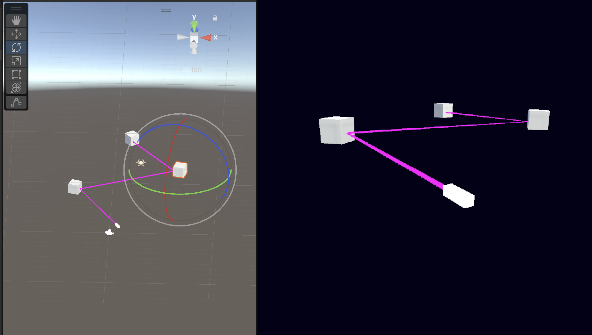

### LaserBeam Game

#### Overview

LaserBeam is a Unity-based game where players interact with dynamic laser beams. This README provides a quick guide to understanding and using the LaserBeam feature in the game.

#### Features

- LaserBeam Object: A visual and interactive laser beam in the game scene.
- Destroy Functionality: Ability to remove the LaserBeam from the scene dynamically.
